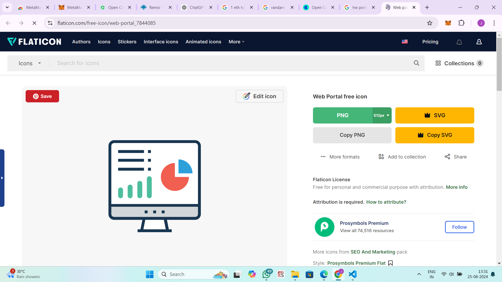
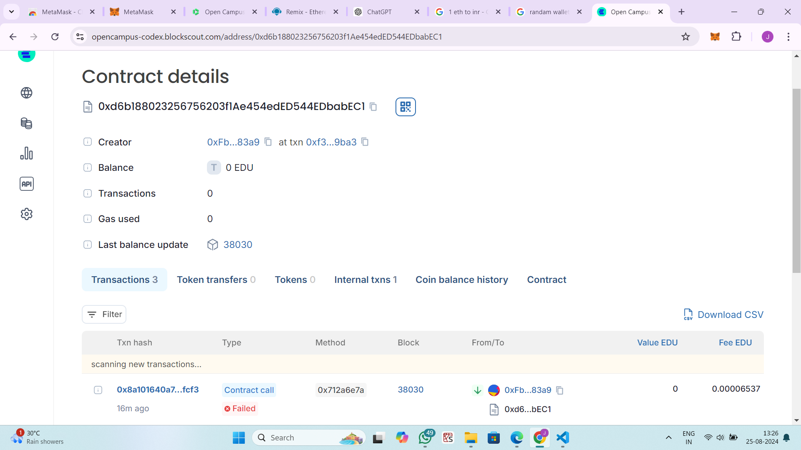

HomeworkSubmission Smart Contract

## Vision
The HomeworkSubmission smart contract aims to streamline the process of grading and rewarding homework submissions in an educational setting. By leveraging Ethereum’s blockchain, this contract automates the grading of submissions and distributes rewards efficiently and transparently. The goal is to provide a fair and secure system for managing academic submissions and incentives.

## Project Features
Submission Handling: Students can submit their homework answers. The contract automatically grades the submission based on predefined criteria.
Reward Distribution: Teachers can reward students with Ether for correctly answered submissions.
Access Control: Only the designated teacher (contract deployer) can perform grading and reward actions.
Fund Management: The contract includes functionality for depositing Ether and checking the contract's balance.
State Tracking: Tracks whether a submission has been graded and whether a reward has been given.
## Future Scope
Enhanced Grading Logic: Implement more sophisticated grading algorithms that can handle a wider variety of questions and answer types.
Partial Credit: Introduce mechanisms for partial credit based on the closeness of the answer to the correct one.
Multi-Teacher Support: Allow multiple teachers to manage and grade submissions, possibly with a role-based access control system.
Automated Reward Distribution: Develop a feature for automatic reward distribution based on predefined criteria without manual intervention.
Integration with Educational Platforms: Integrate with existing educational platforms for seamless submission and grading processes.
User Interface: Build a web or mobile interface for easier interaction with the contract.
## Project Structure
The project consists of a single Solidity smart contract file:

HomeworkSubmission.sol: Contains the HomeworkSubmission contract, which includes:
Struct: Defines the Submission structure to hold information about each submission.
Mappings: Stores submissions keyed by student addresses.
State Variables: rewardAmount for the reward given to students and teacher for the contract deployer’s address.
Modifiers: Restrict certain functions to only the teacher.
Functions:
submitHomework(uint _answer): Allows students to submit their homework and automatically grades it.
rewardStudent(address payable _student): Rewards a student if their submission is graded and correct.
depositFunds(): Allows deposits of Ether into the contract.
getContractBalance(): Returns the contract’s Ether balance.
## Developer Details
Project Lead: [Jagriti]

Contact: [jagritikumari69096@gmail.com]

GitHub Repository: [Link to your GitHub repository if available]

Development Environment:

Solidity Version: ^0.8.0
Tools: Remix IDE, Hardhat (for deployment scripts), Truffle (if applicable)
License: MIT License
## deployment
chain Name:Educhain in open campus
contract id:0xd6b188023256756203f1ae454eded544edbabec1
